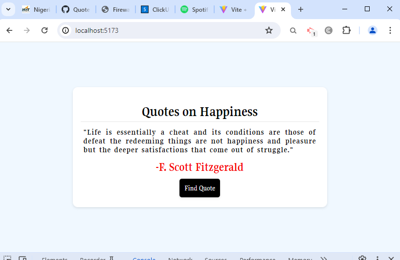

# Random Quote Generator with the Quote API

## Overview

This project is part of the Codevixens 10 Days of Frontend Challenge (Day 4). This Quote Generator application was built using Vite React and CSS. The task focuses on mastering  state management and API integration in ReactJS.

## Features

- **State Management:** React's **useState**  hook were used to manage fetched quotes and handle errors.
- **Event Handling:** The **Find Quote** button gets random quotes from the [QuoteAPI](https://api-ninjas.com/api/quotes).
- **User Interface:** Simple UI that display quotes on happiness and the author's name.

## Installation

1. Clone the repository: ```javascript git clone https://github.com/Nkwor-Jane/quote_generator.git```

2. Navigate to the project directory: ```javascript cd quote_generator```

3. Install dependencies:```javascript npm install```

## Usage

1. Start the development server: ```javascript npm run dev```

2. Open your browser and navigate to: ```javascript http://localhost:5173/```

## How it Works

1. **Submit Button:** Click **Find Quote** button to get random quotes on happiness.
2. **Display:** The quote and author's name will be displayed.

## Screenshots

- Desktop View
  


## Live Demo

Check out the live demo [here](https://quote-generator-nu-five.vercel.app/).

## Contirbuting

Feel free to clone and fork this repository. You can also submit pull requests. Any contributions are welcome!

## License

This project is licensed under the MIT License

## Acknowledgements

- [Codevixens](https://codevixens.org/) for organizing this challenge.
- Lois Bassey, Chinaza Igboanugo, Gaelle Tiku Brenda - and Oyakinsola Shoroye for their contributions and guidance towards the successful completion of this projects.

Feel free to customize it further to fit your needs! If you have any specific details you'd like to add or change, let me know.
